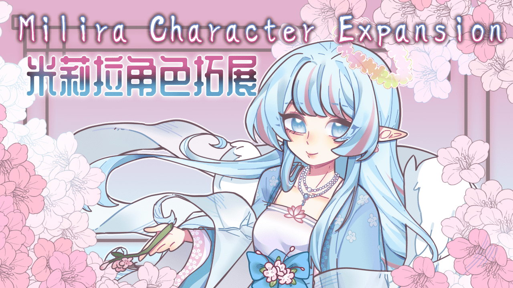

# 米莉拉角色拓展

**Milira Character Expansion · RimWorld 1.6 · master 分支**



为殖民地带来拥有独立故事、专属装备与战斗机制的米莉拉角色。

本模组基于 **Milira Race** 与 **Ariandel Library**。当前 `master` 以 **霓羽、昭离** 的角色玩法和招募流程为主要游玩内容，仓库中另包含开发中的 **清荷** 角色实现。角色拥有较高的原始强度，适合希望体验专属技能、角色剧情与高强度战斗的玩家。

[Steam 创意工坊](https://steamcommunity.com/sharedfiles/filedetails/?id=3684504594) · [下载 master](https://github.com/HeChuanRiver/MiliraXian_NeiyuLaw/archive/refs/heads/master.zip) · [问题反馈](https://github.com/HeChuanRiver/MiliraXian_NeiyuLaw/issues) · [开发分支说明](https://github.com/HeChuanRiver/MiliraXian_NeiyuLaw/blob/dev/README.md)

> 本文只描述 `master` 分支。明渊、三档强度开关、清荷新版花庭／技能树，以及 SDK 风格与 C# 10 工程迁移属于 `dev` 内容，尚未包含在本分支中。不要混用两个分支的 DLL、定义与资源文件。

## 内容导航

- [角色与玩法](#角色与玩法)
- [安装与依赖](#安装与依赖)
- [模组设置](#模组设置)
- [兼容性与存档](#兼容性与存档)
- [反馈问题](#反馈问题)
- [开发与构建](#开发与构建)
- [贡献与致谢](#贡献与致谢)

## 角色与玩法

### 霓羽

围绕多形态武器、机动技能和阶段护盾展开战斗。

- 花、剑、弓三形态装备与近远程技能。
- 多阶段计数护盾及配套状态显示。
- 专属服装、翅膀、飞行动画与技能特效。
- 专属开局「界外羽痕」与「异界羽影」投影招募任务。

### 昭离

围绕死亡、因果与归返建立自己的资源循环。

- 专武「离断」及武器技能「断斩」。
- 告死流场、诡医、定数、冥火、泯神等主动技能。
- 因果资源、因果链接、替死、死亡成长与离场复活机制。
- 「亡者说」与「归亡者」任务链，包含藏身处交涉、后续选择和敌对遭遇。
- 敌对形态具有阶段变化、仇恨与专用施法逻辑。

昭离的任务并非无条件招募。接取前请阅读期限与后果；放任限时交涉不处理可能导致袭击，原始强度下的敌对昭离具有很高威胁。

### 清荷：开发中的角色内容

`master` 保留的是以 **激流／雅乐** 双资源为核心的版本，而非 `dev` 中的新版花庭体系。

当前实现包含琵琶、竹笛、琴形装备，涌泉、水镜、扼流、横指、断魂、阳春等技能，以及长息、花神护体和相关持续场机制。部分视觉资源仍为占位内容，本分支也未提供清荷专属开局与花庭招募任务，不应把她视作与霓羽、昭离同等完整的游玩流程。

模组提供简体中文、繁体中文和英文文本。具体技能效果请以所安装版本的游戏内说明和实际属性为准。

## 安装与依赖

### 运行环境

- **RimWorld 1.6**。
- **Royalty、Biotech**：当前 Milira Race 的前置要求。
- 使用与你的 RimWorld 版本相匹配的前置模组。

### 必需模组

| 模组 | 用途 |
| --- | --- |
| [Milira Race](https://steamcommunity.com/sharedfiles/filedetails/?id=3256974620) | 米莉拉种族及基础定义。 |
| [Ariandel Library](https://steamcommunity.com/sharedfiles/filedetails/?id=3665997350) | 特殊角色管理和共用功能。 |

还需要安装它们自身要求的 [Harmony](https://steamcommunity.com/sharedfiles/filedetails/?id=2009463077)、[Humanoid Alien Races](https://steamcommunity.com/sharedfiles/filedetails/?id=839005762) 与 [Ancot Library](https://steamcommunity.com/sharedfiles/filedetails/?id=2988801276)。完整依赖及版本要求请以各前置页面和游戏的依赖提示为准。

### 安装步骤

1. 下载本页上方的 `master` 分支 ZIP，或使用创意工坊发布版本；两者内容可能不同。
2. 手动安装时，将模组文件夹放入 `RimWorld/Mods/`。文件夹中应直接包含 `About/`、`1.6/`、`Content/` 和 `LoadFolders.xml`，不要多套一层解压目录。
3. 在游戏模组列表启用前置与本模组，处理依赖和排序提示后重启游戏。当前元数据中的显示名称为「米莉拉角色拓展 v1.1dev」。
4. 第一次测试建议使用新存档，或先备份现有存档并使用副本。

仓库包含游戏运行所需的主 DLL。**只游玩不需要安装开发工具，也不需要自己编译。**请安装完整文件夹，不要只替换 DLL 而遗漏贴图、XML 和语言文件。

不要同时启用本模组的工坊版与本地版，避免同名 Def、人物和补丁重复加载。

### 加载顺序

基础原则是先加载被依赖项，再加载依赖它们的模组。Harmony 位于依赖它的模组之前，本模组位于 **Milira Race** 与 **Ariandel Library** 之后。

若同时使用米莉拉基因补丁、米莉拉面部动画补丁、Milira Imperium 或 `HeChuanRiver.MiliraXian`，也应将本模组放在它们之后。这些额外排序对象不是全部必装前置，具体声明见 [About/About.xml](About/About.xml)。

## 模组设置

入口：**选项 → 模组设置 → 米莉拉角色拓展**。

| 设置 | 当前行为 |
| --- | --- |
| 特殊角色管理器集成 | 默认开启，用于角色加入与读档时的注册和状态修复。 |
| 更新来信 | 控制是否接收更新说明来信，也可以在设置页查看更新记录。 |
| 特殊角色意识保底 | 可选最低 100%、最低 35% 或不锁定；默认最低 100%。 |

**master 没有原始／适中／观赏三档开关。**角色技能、装备和被动仍使用本分支的原始数值，意识保底设置也不是整体战斗强度调节器。

## 兼容性与存档

### 可选联动

- **Facial Animation**：按是否启用该模组加载专用眼睛与眼睑定义。
- **Melee Animation**：按是否启用该模组加载独立兼容目录，源码位于 `Source/Compat/MeleeAnimation/`。

上述目录由 [LoadFolders.xml](LoadFolders.xml) 条件加载，无需手动复制到主定义目录。条件兼容内容不等于对所有版本和模组组合的兼容保证。

本分支没有提供 Combat Extended 专用兼容层。修改死亡、复活、伤害结算、人物渲染或特殊角色唯一性的模组，建议先在测试存档中检查组合效果。

### 更新与移除

- 更新前备份存档并记录模组版本或 Git 提交号。
- 不要混装不同分支、不同版本的程序集与 XML。
- 本模组包含自定义人物状态、Hediff 和任务数据；已经产生相关角色或任务的存档，不建议中途直接卸载。
- 回退更新时，应同时恢复匹配的模组版本与更新前存档，不要仅替换旧 DLL。
- 角色注册和复活保护不能替代存档备份，也不代表任意版本之间都能安全切换。

## 反馈问题

请通过 [GitHub Issues](https://github.com/HeChuanRiver/MiliraXian_NeiyuLaw/issues) 提供可复现的问题，尽量附上：

1. RimWorld 版本、启用的 DLC，以及使用的是 `master`、`dev` 还是工坊版。
2. Git 提交号或模组版本、完整模组列表与加载顺序。
3. 涉及的角色、装备、设置和操作步骤。
4. 预期结果、实际结果，以及日志中第一次出现的错误与完整堆栈。
5. 必要的截图或可复现存档副本。

Windows 日志通常位于：

```text
%USERPROFILE%\AppData\LocalLow\Ludeon Studios\RimWorld by Ludeon Studios\Player.log
```

上传日志和存档前，请检查其中是否包含不希望公开的用户名、路径等信息。反馈性能问题时，请同时说明地图规模、参战人数、游戏速度，以及问题是否只在特定技能或特效出现时发生。

## 开发与构建

### 目录结构

```text
About/                       模组信息、封面与工坊 ID
1.6/
  Assemblies/                主程序集
  Defs/                      角色、技能、装备与任务定义
  Languages/                 简体中文、繁体中文、英文
  Mods/                      按需加载的兼容内容
  Patches/                   XML 补丁
Content/Textures/            游戏贴图
Source/
  Common/                    共用资源、异常状态与战斗工具
  Neiyu/                     霓羽
  QingHe/                    清荷的激流／雅乐版本
  Zhaoli/                    昭离
  Compat/MeleeAnimation/     Melee Animation 兼容源码
Directory.Build.props        默认程序集路径与本地配置导入
LoadFolders.xml              版本与条件加载入口
MiliraXian_NeiyuLaw.csproj    主工程
MiliraXIanMA.csproj          Melee Animation 兼容工程
```

### 编译主程序集

`master` 使用**传统 MSBuild 项目格式**，目标框架为 **.NET Framework 4.8.1**，尚未迁移为 SDK 风格工程。以下以 Windows 为基准。

准备好 MSBuild／.NET SDK、.NET Framework 4.8.1 Developer Pack、NuGet CLI，以及本机 RimWorld 与前置模组程序集。

在仓库根目录，根据 [Directory.Build.local.props.example](Directory.Build.local.props.example) 创建 `Directory.Build.local.props`，填写自己的安装位置，例如：

```xml
<Project>
  <PropertyGroup>
    <RimWorldInstallDir>C:\Games\Steam\steamapps\common\RimWorld</RimWorldInstallDir>
    <RimWorldWorkshopDir>C:\Games\Steam\steamapps\workshop\content\294100</RimWorldWorkshopDir>
  </PropertyGroup>
</Project>
```

本地配置文件已被 Git 忽略，不应提交个人安装路径。必要时可在其中覆盖 `RimWorldManagedDir`、`AriandelLibraryDll` 和 `ZAnimationModDll`；路径解析规则见 [Directory.Build.props](Directory.Build.props)。

在仓库根目录运行：

```powershell
nuget restore .\packages.config -PackagesDirectory .\packages

dotnet msbuild .\MiliraXian_NeiyuLaw.csproj /t:Build /p:Configuration=Release
```

Harmony 2.4.2 由 `packages.config` 恢复到 `packages/`，其他游戏和前置程序集由本机安装提供。输出为 `1.6/Assemblies/MiliraXian_NeiyuLaw.dll`；使用 `Configuration=Debug` 可构建调试版本。

如需构建可选的 Melee Animation 兼容层，先配置 `ZAnimationModDll`，再运行：

```powershell
dotnet msbuild .\MiliraXIanMA.csproj /t:Build /p:Configuration=Release
```

兼容程序集输出到 `1.6/Mods/co.uk.epicguru.meleeanimation/Assemblies/`。不要把 `dev` 的工程文件名或构建步骤直接用于本分支，也不要在游戏运行时覆盖程序集。

编译通过后仍应测试游戏加载、读档、招募、战斗和角色返回流程。如提示缺少程序集引用，请先核对前置安装情况与本地路径配置。

## 贡献与致谢

项目作者：**HeChuanRiver**。

感谢 Milira Race、Ancot Library、Ariandel Library、Humanoid Alien Races、Harmony 及可选联动模组的作者，也感谢提供角色美术、封面、测试与反馈的贡献者。美术与社区致谢可参见 [创意工坊页面](https://steamcommunity.com/sharedfiles/filedetails/?id=3684504594)，代码贡献记录见 [Contributors](https://github.com/HeChuanRiver/MiliraXian_NeiyuLaw/graphs/contributors)。

提交问题或补丁时，请明确目标分支；功能开发通常在 `dev` 进行，不应把仅适用于开发分支的说明、资源或工程配置直接覆盖到 `master`。涉及玩家可见文本时，请同步检查三种语言，不要提交临时产物、游戏存档或第三方游戏程序集。

仓库目前未附统一的 `LICENSE` 文件。复用代码、美术或其他资源前，请向维护者确认相应内容的授权范围；本 README 不额外授予第三方素材的使用许可。
